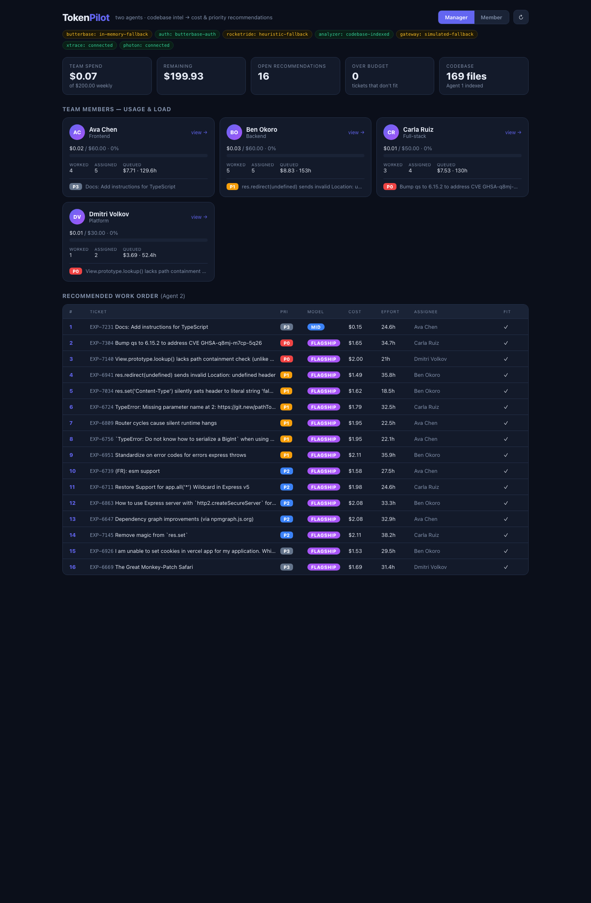

# TokenPilot 🪄

**The autonomous cost-and-priority brain for your engineering backlog.**

Given your team's AI budget and your ticket priorities, TokenPilot decides *what to work on, in what order, and which model to use for each task* — to get the most important work done inside budget, with zero human tuning. It reads your real codebase and your real tickets, routes each task to the right‑sized **Claude** model, bills every call against a team/per‑member budget, and proactively messages the team when priorities shift.

Built on four sponsor platforms:

| Platform | Role in TokenPilot |
|---|---|
| **RocketRide** | the multi‑agent pipeline runtime (estimate → budget → route → context → monitor) |
| **Butterbase** | backend (tickets, budget, usage) **+ auth + the AI Model Gateway** that does the actual model switching |
| **XTrace** | the memory layer — facts/episodes about ticket costs, plus contradiction/supersede reconciliation |
| **Photon / Spectrum** | messaging delivery — the agent answers in‑channel **and** proactively pushes alerts (iMessage) |



---

## Table of contents

1. [How it works — the two‑agent design](#how-it-works--the-two-agent-design)
2. [The two dashboards](#the-two-dashboards)
3. [Prerequisites](#prerequisites)
4. [Quickstart (TL;DR)](#quickstart-tldr)
5. [Environment configuration (`.env`)](#environment-configuration-env)
6. [The Butterbase MCP server](#the-butterbase-mcp-server)
7. [Giving it data — repo + tickets](#giving-it-data--repo--tickets)
8. [Running the project](#running-the-project)
9. [Verifying everything works](#verifying-everything-works)
10. [Features](#features)
11. [API reference](#api-reference)
12. [Platform integration status](#platform-integration-status)
13. [Messaging (Photon / iMessage)](#messaging-photon--imessage)
14. [Project structure](#project-structure)
15. [Troubleshooting](#troubleshooting)
16. [Roadmap / upgrades](#roadmap--upgrades)

---

## How it works — the two‑agent design

TokenPilot runs **two cooperating agents**. Agent 1 has the context; Agent 2 makes the call.

```
input/codebase/  +  input/jira/ (tickets)
        │
        ▼
┌───────────────────────┐   intel    ┌──────────────────────────┐   recommendations
│  AGENT 1              │ ─────────▶ │  AGENT 2                 │ ─────────────────▶  dashboards
│  Codebase Intelligence│            │  Advisory / Recommender  │                     + messaging
│  (analyzer.js)        │            │  (recommender.js)        │
└───────────────────────┘            └──────────────────────────┘
 scans the whole codebase,            consumes Agent 1's intel and decides:
 finds the files each ticket          priority order · cost ($) · effort/time ·
 touches, scope/LOC, complexity        model tier · suggested assignee · "why"
```

- **Agent 1 — Codebase Intelligence** (`server/agents/analyzer.js`): recursively reads everything in `input/codebase/` (skipping `node_modules`, `.git`, build output, binaries) and, for each ticket, produces *intel* — related files, touched areas, change‑surface size (LOC), complexity signals, a summary.
- **Agent 2 — Advisory / Recommender** (`server/agents/recommender.js`): never reads the codebase itself. It consumes Agent 1's intel + the team roster + current usage + remaining budget, and outputs the recommendations the dashboards render — **priority order, projected cost, effort/time, model tier, suggested assignee, and a one‑line "why."**
- The handoff is one function: `server/agents/orchestrator.js → runPipeline()`.

**Model routing.** Each ticket is routed to a Claude tier by priority + complexity + whether context is already established:

| Tier | Model | When |
|---|---|---|
| `flagship` | `claude-opus-4.8` | P0 / heavy reasoning |
| `mid` | `claude-sonnet-4.6` | moderate work |
| `cheap` | `claude-haiku-4.5` | grunt work / once context is established |

The actual model call goes through the **Butterbase AI Gateway** (`server/gateway.js`). Switching models = changing one string — that's the whole point.

> **There are two gateway paths, both Butterbase.** (1) The `/work` route's real model call goes direct through `gateway.js` using `BUTTERBASE_GATEWAY_KEY` + `BUTTERBASE_APP_ID`. (2) The RocketRide estimator pipeline's LLM node calls Butterbase through `ROCKETRIDE_GATEWAY_URL` (the base URL embeds the app id) + `ROCKETRIDE_GATEWAY_KEY`. Same gateway, two callers.

## The two dashboards

| View | Who | Shows |
|------|-----|-------|
| **Manager** | Team lead | Each member's **current usage** + load, the team budget, and the team‑wide prioritized queue. **No per‑event history** — the "now." |
| **Member** | Individual | That member's usage, their Agent‑2 **recommendations** (priority/cost/effort, with a *Work* action), and their **full history** of worked tickets. |

Switch with the **Manager / Member** toggle (top right); click any member card in the manager view to jump to their dashboard. The manager view can also **add a ticket** and **drag-reorder** the queue (persisted as `manualRank`).

A third **Agent 1 · Codebase Intelligence** page (`web/src/views/IndexingView.jsx`) opens from the manager view's *Codebase* stat: it shows how many files Agent 1 indexed from `input/codebase/` and, per ticket, the related files, change surface, touched areas, and cross-module/test signals.

---

## Prerequisites

- **Node.js ≥ 18** (the project uses native `fetch` and ESM). Tested on Node 26.
- **npm** (bundled with Node).
- Optional, for full live mode:
  - The **RocketRide VS Code extension** — it starts the local RocketRide engine (`connectionMode: local`) that runs the estimator pipeline. (No Docker needed.)
  - A **Butterbase** account (DB + AI Gateway), an **XTrace** account (memory), and a **Photon** project (messaging). All have graceful fallbacks, so the app runs end‑to‑end without them.
  - **`gh`** (GitHub CLI) — only if you want to pull a repo's issues as tickets the way the demo does.

## Quickstart (TL;DR)

```bash
# 1. install backend + frontend deps
npm install
cd web && npm install && cd ..

# 2. create your env file (runs on fallbacks even if left mostly blank)
cp .env.example .env        # then fill in keys — see "Environment configuration" below

# 3. (optional) give it real data — see "Giving it data"
#    else it falls back to data/seed_tickets.json automatically

# 4. run the backend            (auto-loads tickets on boot)
npm start                   # → http://localhost:3001

# 5. run the frontend (new terminal)
cd web && npm run dev       # → http://localhost:5173
```

Open **http://localhost:5173**. That's the whole app.

> **It runs before you configure anything.** Every platform has a fallback, so you get working dashboards immediately and flip each platform to "live" as you add keys.

---

## Environment configuration (`.env`)

Copy `.env.example` → `.env` and fill what you have. Every variable, what it's for, and where to get it:

### RocketRide — the pipeline runtime
The SDK (`rocketride`) connects to the **local engine started by the VS Code extension** (`connectionMode: local`) over its DAP WebSocket and runs the estimator pipeline (`pipeline/estimate.pipe`). The LLM node inside that pipeline calls the Butterbase gateway. If the engine is down, `server/rocketrideClient.js` returns `null` and `rocketride.js` falls back to the XTrace‑grounded heuristic.

| Variable | Required? | Notes |
|---|---|---|
| `ROCKETRIDE_URI` | Yes | `<host:port>` of the local engine, e.g. `localhost:60311`. **The port is ephemeral** — if the extension restarts the engine, find the new one with `lsof -nP -iTCP -sTCP:LISTEN \| grep engine` and update this. |
| `ROCKETRIDE_APIKEY` | Yes | The OSS engine accepts any non‑empty key (the extension starts it without one). Use `local`. (Read by the SDK.) |
| `ROCKETRIDE_API_KEY` | No | Only for **RocketRide Cloud**; leave blank for local. |
| `ROCKETRIDE_GATEWAY_URL` | For real estimates | OpenAI‑compatible base for the pipeline's LLM node, e.g. `https://api.butterbase.ai/v1/<app_id>`. |
| `ROCKETRIDE_GATEWAY_KEY` | For real estimates | `bb_sk_…` (the same Butterbase key). |

Build/edit the `.pipe` pipeline visually with the **RocketRide VS Code extension**, which also starts the engine.

### Butterbase — backend + auth + AI Gateway
| Variable | Required? | Notes |
|---|---|---|
| `BUTTERBASE_API_KEY` | Yes | `bb_sk_…` — project API key (DB + auth). |
| `BUTTERBASE_PROJECT_URL` | For real DB | Project URL/ID from Butterbase settings. Until set, the DB uses an in‑memory store. |
| `BUTTERBASE_GATEWAY_KEY` | For real model calls | Bearer token for the AI Gateway. |
| `BUTTERBASE_APP_ID` | For real model calls | The `{app_id}` in `https://api.butterbase.ai/v1/{app_id}/chat/completions`. |
| `BUTTERBASE_GATEWAY_URL` | No | Override gateway base (default `https://api.butterbase.ai/v1`). |
| `BUTTERBASE_MODEL_FLAGSHIP` / `_MID` / `_CHEAP` | No | Override the gateway model slugs (default `anthropic/claude-opus-4.8`, `…sonnet-4.6`, `…haiku-4.5`). |

The gateway is **OpenAI‑compatible**: `POST /v1/{app_id}/chat/completions`, `Authorization: Bearer …`, response in `choices[0].message.content` with `usage.{prompt,completion}_tokens`.

### XTrace — memory layer
| Variable | Required? | Notes |
|---|---|---|
| `XTRACE_API_KEY` | For live memory | `xtk_…` from app.xtrace.ai. |
| `XTRACE_ORG_ID` | For live memory | Org ID from app.xtrace.ai settings — **required** alongside the key for `@xtraceai/memory` to go live. |
| `XTRACE_ENDPOINT` | No | Override the SDK base URL (default `https://api.production.xtrace.ai`). Optional. |

Both `XTRACE_API_KEY` **and** `XTRACE_ORG_ID` must be set for `xtrace: connected`; otherwise it uses the local in‑memory mirror.

### Photon / Spectrum — messaging
| Variable | Required? | Notes |
|---|---|---|
| `PHOTON_PROJECT_ID` | Yes | From app.photon.codes. |
| `PHOTON_SECRET` | Yes | From app.photon.codes. |
| `PHOTON_TARGET` | For proactive pushes | iMessage recipient — phone `+15551234567` or handle `name@example.com`. Inbound replies work without it. |
| `PHOTON_TEAM_ID` | No | Only if you switch the provider back to Slack. |

### Data + server + optional fallback
| Variable | Notes |
|---|---|
| `DATASET_PATH` | Seed dataset path (default `data/seed_tickets.json`). |
| `PORT` | Backend port (default `3001`). |
| `ANTHROPIC_API_KEY` / `OPENAI_API_KEY` | Optional direct‑LLM insurance if the gateway flakes. |

> **`.env` is git‑ignored** — your keys never get committed. So is `.mcp.json` (see below).

## The Butterbase MCP server

Butterbase is designed to be provisioned **by your coding agent** (Claude Code / Cursor). Register its MCP server once, globally:

```bash
claude mcp add butterbase https://api.butterbase.ai/mcp \
  --transport http --scope user \
  --header "Authorization: Bearer bb_sk_YOUR_KEY"
```

Verify with `claude mcp list` (should show `butterbase: ✓ Connected`), then in a fresh chat:

> *I'm using Butterbase as my backend. Call the butterbase_docs tool with topic "overview" to learn about the platform.*

This lets the agent provision DB tables (tickets, budget, usage, history) directly. The credential lives in `~/.claude.json` (user scope), not in the repo.

## Giving it data — repo + tickets

Paste your real data into the **held** `input/` folder (its contents are git‑ignored, so paste freely):

- **`input/codebase/`** — drop (or clone) the repo you want analyzed here. Agent 1 indexes it.
- **`input/jira/`** — drop exported tickets as `.json`/`.csv` (any column names — the ingest normalizes `key/id`, `summary/title`, `description`, `priority/severity`, `issuetype/type`, `status`). Falls back to `data/seed_tickets.json` if empty.

### Demo: turn a real GitHub repo's issues into tickets

This is exactly how the screenshot above was produced — Express's source as the codebase, its open issues as the backlog:

```bash
# 1. clone the repo to analyze
git clone --depth 1 https://github.com/expressjs/express input/codebase/express

# 2. pull its open issues as JSON
gh issue list --repo expressjs/express --state open --limit 16 \
  --json number,title,body,labels,createdAt > /tmp/issues.json

# 3. convert issues -> tickets (maps labels to P0–P3 / bug·feature·refactor·docs),
#    writing input/jira/tickets.json  (see commit history for the transform snippet)
```

Each issue becomes `{ id: "EXP-<number>", title, description, priority, type, status, labels }`. On boot the server loads `input/jira/` if present, else the seed.

**Internal ticket shape:**
```json
{ "id": "TICK-101", "title": "...", "description": "...", "priority": "P0", "type": "bug", "status": "open" }
```

**Team roster** lives in `data/team_members.json` — id, name, role, `skills`, and `weeklyBudgetUSD`. Agent 2 assigns tickets by skill match + load balancing.

## Running the project

```bash
# backend — Express API on :3001 (auto-loads tickets, connects Photon, etc.)
npm start            # or: npm run dev   (node --watch, auto-restart on change)

# frontend — Vite dev server on :5173, proxies /api → :3001
cd web && npm run dev
```

To re‑load a fresh set of tickets, delete the local fallback store so the server re‑ingests on boot:
```bash
rm -f .fallback-store.json && npm start
```

Populate the dashboards with worked usage by running the agent on tickets (auto‑creates a demo session):
```bash
curl -s -X POST http://localhost:3001/work/EXP-7304 -H 'Content-Type: application/json' -d '{}'
```

## Verifying everything works

```bash
# platform + agent status (live vs fallback)
curl -s http://localhost:3001/health

# tickets loaded
curl -s http://localhost:3001/tickets | head

# manager dashboard (per-member usage + team queue)
curl -s http://localhost:3001/team

# the agent brain (what Photon delivers to iMessage)
curl -s -X POST http://localhost:3001/chat -H 'Content-Type: application/json' \
  -d '{"text":"what should I work on next?"}'
```

A healthy boot logs something like (exact statuses depend on which keys you've set — every platform is independent):
```
TokenPilot server on :3001
[ingest] loaded 16 tickets from input/jira (1 file)
[rocketride] local engine connected; estimator pipeline live (…).
[photon] Spectrum connected (iMessage provider). Listening for inbound messages.
[xtrace] seeded 4 team facts
Platform status → { butterbase: 'connected', auth: 'butterbase-auth',
  rocketride: 'engine-connected', analyzer: 'codebase-indexed',
  gateway: 'connected', xtrace: 'connected', photon: 'connected' }
```
Each platform reports `connected` (or its specific live label) when its keys are present, and a `*-fallback` otherwise — e.g. `rocketride: 'heuristic-fallback'` if the local engine isn't running, `gateway: 'simulated-fallback'` without `BUTTERBASE_APP_ID` + `BUTTERBASE_GATEWAY_KEY`, `analyzer: 'text-only-fallback'` if no codebase is pasted.

## Features

- **Budget‑aware prioritization** — Agent 2 orders the whole backlog to maximize important work done inside the remaining budget; flags tickets that don't fit.
- **Per‑ticket model routing** — P0/complex → Opus, moderate → Sonnet, grunt work / established context → Haiku. One gateway, swap models by name.
- **Live cost + token accounting** — every model call is billed against the team budget and attributed to a member (powers both dashboards).
- **Codebase‑aware estimates** — Agent 1 reads the actual repo to size each ticket (touched files, LOC, complexity) instead of guessing from text.
- **Skill‑ + load‑based assignment** — Agent 2 suggests an assignee per ticket from the roster.
- **Two dashboards** — manager "now" view and member deep view (recommendations + history).
- **Proactive messaging** — a P0 landing or a low budget triggers an iMessage push; the same agent brain answers natural‑language questions in‑channel.
- **Memory + reconciliation** — XTrace stores facts/episodes about ticket costs and can supersede a stale belief when new info contradicts it.
- **Runs on fallbacks** — every platform degrades gracefully, so the app never hard‑fails during a demo.

## API reference

| Route | Purpose |
|-------|---------|
| `GET /health` | per‑platform + per‑agent status (live vs. fallback) |
| `GET /tickets` | raw normalized tickets |
| `POST /tickets` | manager: create a ticket (optionally pre‑assigned) |
| `POST /reorder` | manager: persist a manual drag‑reorder (`manualRank`) |
| `GET /board` | tickets grouped/ordered for the board |
| `GET /intel` | **Agent 1** output — codebase intel per ticket |
| `GET /recommendations` | **Agent 1 + 2** — full pipeline result |
| `GET /budget` | current budget (period, total, consumed) |
| `GET /team` | **Manager dashboard** — usage per member + team queue (no history) |
| `GET /team/:id` | **Member dashboard** — usage + history + their recommendations |
| `POST /work/:id` | (auth‑gated) estimate → route → call model via gateway → bill → attribute to a member → push on completion |
| `POST /chat` | the agent brain (what Photon delivers to iMessage) |
| `GET /memory` | XTrace beliefs + version history (pass `?q=` to search) |
| `POST /simulate-model-update` | XTrace reconciliation demo kicker |
| `POST /auth/signup` · `POST /auth/login` | Butterbase auth (demo auto‑session via `requireAuth`) |

## Platform integration status

`/health` reports each platform as `connected` (or its specific live label) or a `*-fallback`. **All four platforms are now wired to their real SDK/API** — each flips from fallback to live as soon as its keys (or the local engine) are present:

| Platform | Code wired | Flips to live when… | Fallback when absent |
|---|---|---|---|
| **Photon (iMessage)** | ✅ real Spectrum client (`photon.js`) | `PHOTON_PROJECT_ID` + `PHOTON_SECRET` set (`PHOTON_TARGET` for proactive pushes) | console fallback (`/chat` still exercises the inbound flow) |
| **XTrace** | ✅ real `@xtraceai/memory` SDK (`xtrace.js`) — ingest + vector search + reconcile, with a local mirror for the beliefs UI | `XTRACE_API_KEY` + `XTRACE_ORG_ID` set | `in-memory-fallback` (local facts only) |
| **Butterbase — Gateway** | ✅ OpenAI‑compatible call (`gateway.js`) | `BUTTERBASE_GATEWAY_KEY` + `BUTTERBASE_APP_ID` set | `simulated-fallback` (canned model response) |
| **Butterbase — DB/auth** | ✅ live REST data API (`butterbase.js`) — tickets/budget/usage/history | `BUTTERBASE_API_KEY` + `BUTTERBASE_PROJECT_URL` set | `in-memory-fallback` (`.fallback-store.json`) |
| **RocketRide** | ✅ real SDK → local engine, runs `pipeline/estimate.pipe` (`rocketrideClient.js`) | the VS Code extension's local engine is running + `ROCKETRIDE_URI` points at it | `heuristic-fallback` (XTrace‑grounded estimate) |

> The app is fully usable in every "fallback" state — these are graceful degradations, not blockers. The wiring is done; the only thing standing between a fallback and "live" is the corresponding key/engine.

## Messaging (Photon / iMessage)

`server/photon.js` uses the real **Spectrum** SDK (`spectrum-ts`) with the **iMessage** provider (Photon Cloud‑managed credentials, so no local token).

- **Inbound:** an async‑iterator loop (`for await … of app.messages`) routes each message to the agent brain and replies in‑thread. Runs in the background; never blocks boot.
- **Outbound (proactive):** `pushNotification(target, text)` opens a DM space (`imessage(app).space({ phone })`) and sends. Targets come from `PHOTON_TARGET` (a phone/handle).
- **Resilient:** if Spectrum can't connect, it logs and degrades to the console fallback (the `/chat` route still exercises the inbound flow), so the server always boots.
- **Switching to Slack:** change the import + provider in `photon.js` to `slack` from `spectrum-ts/providers/slack`, target by `teamId/channel`, and enable Slack on your Photon project.

## Project structure

| File | Does |
|------|------|
| `server/index.js` | Express routes + boot (ingest, Photon init, status log) |
| `server/inputs.js` | reads `input/codebase/` + `input/jira/` (with fallbacks) |
| `server/ingest.js` | normalizes any CSV/JSON dataset → internal ticket shape |
| `server/agents/analyzer.js` | **Agent 1** — codebase intelligence |
| `server/agents/recommender.js` | **Agent 2** — priority/cost/effort/assignee recommendations |
| `server/agents/orchestrator.js` | runs Agent 1 → Agent 2 (`runPipeline`) |
| `server/team.js` | roster + assembles the manager & member dashboards |
| `server/butterbase.js` | tickets, budget, **per‑member usage + history** |
| `server/gateway.js` | Butterbase AI Gateway — model switching (OpenAI‑compatible) |
| `server/xtrace.js` | XTrace memory: real `@xtraceai/memory` ingest/search + reconciliation (local mirror) |
| `server/rocketride.js` | estimate / route / order — calls the real engine, heuristic fallback |
| `server/rocketrideClient.js` | real RocketRide SDK: connects the local engine, runs the estimator pipeline |
| `pipeline/estimate.pipe` · `tokenpilot_pipeline.json` | the live `.pipe` estimator pipeline · the full design definition |
| `server/photon.js` · `auth.js` | iMessage delivery (Spectrum) · Butterbase auth |
| `web/src/views/ManagerView.jsx` · `MemberView.jsx` · `IndexingView.jsx` | manager + member dashboards · Agent‑1 codebase‑intel page |
| `data/team_members.json` · `data/seed_tickets.json` | roster (4 members) · seed backlog (8 tickets) |

## Troubleshooting

- **Port already in use** — `lsof -ti:3001 | xargs kill -9` (or `:5173` for the web server).
- **Tickets didn't refresh** — the server only auto‑loads when the store is empty: `rm -f .fallback-store.json && npm start`.
- **`gateway: simulated-fallback`** — you still need `BUTTERBASE_GATEWAY_KEY` **and** `BUTTERBASE_APP_ID`; both must be set.
- **Gateway 4xx with valid keys** — the model slug may not match Butterbase's catalog; set `BUTTERBASE_MODEL_FLAGSHIP/_MID/_CHEAP` to the IDs your gateway exposes.
- **`photon: error-fallback` / "X is not enabled for this project"** — enable that provider (iMessage/Slack) on your Photon project at app.photon.codes.
- **Frontend shows no data** — make sure the backend is up on `:3001` (the Vite proxy maps `/api` → `:3001`).

## Roadmap / upgrades

All four platforms are now wired to their real SDK/API; each goes live the moment its keys (or the local engine) are present. Done:

- [x] **Butterbase DB** — `butterbase.js` hits the live REST data API (tickets, budget, usage, history); set `PROJECT_URL` to enable.
- [x] **Butterbase Gateway** — real OpenAI‑compatible Claude calls; set `GATEWAY_KEY` + `APP_ID` to enable.
- [x] **XTrace** — `xtrace.js` ingests/searches via `@xtraceai/memory`; reconcile supersedes contradicted beliefs. Set `XTRACE_API_KEY` + `XTRACE_ORG_ID`.
- [x] **RocketRide** — `rocketrideClient.js` runs `pipeline/estimate.pipe` on the local engine; start the VS Code extension's engine and set `ROCKETRIDE_URI`.
- [x] **Photon** — real Spectrum iMessage client; pushes on every completion. Set `PHOTON_TARGET` for the recipient.

Still open:

- [ ] **Auth** — replace the demo auto‑session in `auth.js` with real Butterbase signup/login/session.
- [ ] **Slack provider** — optionally add Slack alongside iMessage in `photon.js`.
- [ ] **Model slugs** — confirm the gateway model slugs match your Butterbase catalog (override via `BUTTERBASE_MODEL_FLAGSHIP/_MID/_CHEAP`).

Background and key‑setup notes live in `hackathon_build_plan.md` and `tokenpilot_keys_setup.md`.
